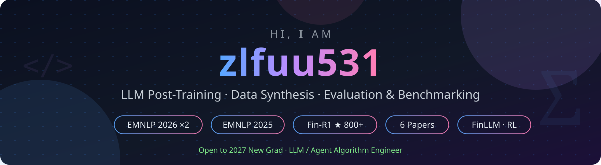

  

  

  

  
  
  
   
  
  
  

> 我的方向是 **LLM 的数据合成、评测与后训练**——三篇论文发表于 EMNLP 2025 & 2026(金融多模态基准 + 多模态数学数据合成,两篇共一);作为核心成员构建 Fin-R1 金融推理大模型(800+ ★、100+ 引用);一作提出 FinGAIA 金融 Agent 基准,纳入行业团体标准白皮书。

---

## 🎓 教育背景

  <b>本科 &amp; 硕士 · 上海财经大学(SUFE)</b>

---

## 💼 实习经历

#### 🏢 阿里巴巴集团 · 平台技术 · AI Data 数据合成团队
`数据算法实习生` · `2026.03 – 2026.08`

- 🕹️ **Agent 评测「ClawBench」**——设计 **40+** 道覆盖 **7** 类金融产出物的端到端长程 Agent 任务;参与设计 **200 题**真实场景金融 Agent 评测集,并搭建**质检 Agent** 支撑迭代优化
- 🖼️ **金融复杂多模态评测集**——**400** 题,设计 L1–L4 难度筛选、专家标注标准与 pass@8 复筛,完成 **9 个**前沿模型评测(头部模型 pass@2 仅 **54%**)
- ⚙️ **评测质检一体化平台**——独立搭建,支持 QA / 多模态 / Rubric / Agent 多维裁判,单月运行 **27 个**任务;制定 **3,000 条**采购后训练数据验收标准(pass@1 <40% 难度门槛 + 双次独立多模型三档判定)
- 📦 **数据交付**——**1,024** 道考研金融题得分点全量生成;长文本 QA Rubric 优化(**97/99** 通过)
- 🧪 **一作研究 [GEO-Poison-Bench](https://github.com/zlfuu531/GEO-Poison-Bench)**——9 种攻击类型 × 18 个行业,**1,578 题 × 24 模型**评测榜单
- 📄 **共一研究 [AgSynth](https://github.com/Yaxuan7690/AgSynth)(EMNLP 2026)**——不到 1 万条合成数据全面提升多模态数学推理(WeMath **+7.42**、LogicVista **+9.15**)

---

## 🚀 项目经历

#### 🏦 国泰海通证券 · 生成式奖励模型训练
`偏好评估模型训练` · `2025.12 – 2026.03`

- 🎯 **训练**——基于 Qwen3-8B,think / rubric / process / answer 四段式偏好数据蒸馏;16×A800 上完成 SFT(16k)+ GRPO(10k),设计过程奖励、正确率奖励、格式奖励多维激励机制;构建 **500 条**完全人工对齐的评测集
- 📈 **效果**——围绕准确性、相关性、语义一致性、流畅性、覆盖度、专业性生成多维 rubric 并给出最优偏好,评测分数 **58 → 94**,与人工偏好精准对齐

#### 🏦 国泰海通证券 · 信用 AI 助手 · 融资融券大模型
`垂类大模型训练` · `2025.05 – 2025.07`

- 💬 **训练**——16×H800 上完成 SFT + DPO 两阶段训练(Qwen3-32B / Qwen3-30B-A3B;8k SFT 数据、7k DPO 三元组、500 条经一致性校验的评测集)
- 🚀 **落地**——得分 **3.79 → 6.09 / 10**(+60%),缓解「无法回答却幻觉回答」问题;**通过内部评测上线生产**,758 份盲测获 **63%** 用户偏好

#### 🧪 Fin-R1 — 金融推理大模型
`R1 式推理训练 + 垂类迁移` · `2025.02 – 2025.04`

- 🔥 构建**国内首个 DeepSeek-R1 式金融推理大模型(7B)**——DeepSeek-R1 蒸馏 + Qwen2.5-72B 双重打分过滤,构建 **6w+** 高质量 CoT 数据;SFT 预热 + GRPO(格式 / 准确率奖励)
- 🏆 五个金融基准平均 **75.2、排名第 2**,ConvFinQA(85.0)/ FinQA(76.0) **SOTA**;[开源](https://github.com/SUFE-AIFLM-Lab/Fin-R1)获 **800+ stars、100+ 引用**;迁移至挖票选股模型(内部评测 **26 → 59**,格式一致性 **99%**)

---

## 📝 学术成果

| 成果 | 发表 | 角色 |
|:---|:---:|:---:|
| **[AgSynth](https://github.com/Yaxuan7690/AgSynth)** — 多智能体反向合成多模态数学推理数据 |  | 共一 |
| **[UniFinEval](https://github.com/aifinlab/UniFinEval)** — 文本·图像·视频统一金融多模态评测;独立搭建数据管线(3k+ 跨模态 QA) |  | 共一 |
| **[VisFinEval](https://github.com/SUFE-AIFLM-Lab/VisFinEval)** — 场景驱动的中文金融多模态基准(15k+ QA) |  | 作者 |
| **[Fin-R1](https://github.com/SUFE-AIFLM-Lab/Fin-R1)** — 强化学习驱动的金融推理大模型,100+ 引用 |  |  |
| **[GEO-Poison-Bench](https://github.com/zlfuu531/GEO-Poison-Bench)** — LLM 对 GEO 投毒攻击的鲁棒性评测 |  | **一作** |
| **[FinGAIA](https://github.com/SUFE-AIFLM-Lab/FinGAIA)** — 真实金融场景 AI Agent 中文基准(407 任务) |  | **一作** |

---

## 💻 开源项目

| 项目 | 说明 | Stars |
|:---|:---|:---:|
| **[PaperHub](https://skymoon11.top/paper)** 🌐 | 自托管论文调研知识库——博客式阅读 + AI Deep-Research Agent 自动抓取并结构化入库(Next.js · Prisma) |  |
| **[QualEval](https://github.com/zlfuu531/QualEval)** | 本地化质检 + 评测平台:数据导入 → 质检 → 评测全前端操作 |  |
| **[OpenReward-verl](https://github.com/zlfuu531/OpenReward-verl)** | 基于 verl 的生成式奖励模型训练:Rubric 偏好评估(SFT + GRPO) |  |
| **[VQA-Data-Generator](https://github.com/zlfuu531/VQA-Data-Generator)** | 多模态 VQA 数据合成管线,支撑 [UniFinEval](https://github.com/aifinlab/UniFinEval) 数据构建 |  |
| **[OpenR1-GRPO](https://github.com/zlfuu531/OpenR1-GRPO)** | R1 式 GRPO 复现与训练框架 |  |
| **[llm-study](https://github.com/zlfuu531/llm-study)** | LLM 学习笔记、Q&A 与精选资源 |  |

---

## 🛠️ 技术栈

<b>后训练</b> 

`数据蒸馏` `奖励函数设计` `消融实验` `垂类迁移`

<b>数据与评测</b> 

<b>工程</b> 

`评测平台` `质检 Agent` `批量数据 pipeline`

---

## 🏆 荣誉奖项

🥈 中国国际大学生创新大赛(2025)上海赛区**银奖**(含上财校赛一等奖) 
🥇 第十届「汇创青春」上海大学生文化创意作品展示活动**上海市一等奖**

---

  <picture>
    <source media="(prefers-color-scheme: dark)" srcset="assets/github-contribution-grid-snake-dark.svg">
    
  </picture>

  
<a href="https://github.com/zlfuu531#readme"><b>↑ Back to English / 回到英文版</b></a>

  <i>「基准告诉你模型在哪里,数据决定模型能走多远。」</i>

